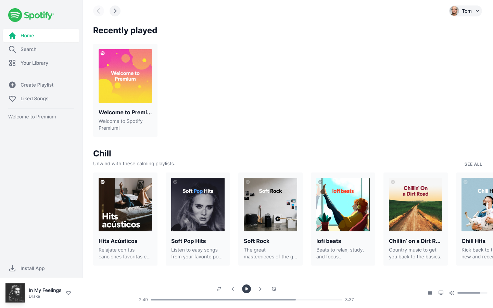

<div align="center">
  
</div>

<h1 align="center" style="display: flex; align-items: center; justify-content: center; gap: 1rem;">Spotify UI Concept</h1>

<h4 align="center">
  A simple concept design of the Spotify home screen.
</h4>
<h5 style="margin-top: -8px;" align="center">Design by Javier Alaves</h5>

<p align="center">
  <a href="#-technologies">technologies</a>&nbsp;&nbsp;&nbsp;|&nbsp;&nbsp;&nbsp;
  <a href="#-como-executar">Como executar</a>&nbsp;&nbsp;&nbsp;|&nbsp;&nbsp;&nbsp;
  <a href="https://figma.com/community/file/1033020390984131809" target="_blank">Design File</a>&nbsp;&nbsp;&nbsp;
</p>

## 👨‍💻 About

A simple concept design of the Spotify home screen developed in Next.JS 13 with
skeleton loading and a simple music player. Following the design file by Javier
Alaves disposable in Figma

## 🧪 Technologies

The following technologies were used:

- Next 13
- Typescript
- Eslint
- Prettier
- Tailwind Merge
- clsx

## 🧑‍🔧 Features

Some features

- Playing/Pausing audio
- Handling time of audio
- Audio timeline

## 🚀 Como executar

Faça um clone do projeto e acesse a pasta criada.

```
  $ git clone https://github.com/fabriciolak/ignite-shop.git
  $ cd ignite-shop
```

Para iniciá-lo, siga os passos abaixo:

## 👾 Instalar as dependências

Aliases: `install`

```
  $ yarn
```

## 😎 Iniciar o projeto

```
  $ yarn dev
```

A aplicação estará disponível no endereço http://localhost:3000.

## 🎨 Layout

Acesse o layout do desafio

Criado com Figma.

<a href="https://www.figma.com/file/kJX0eJI4OLxasc9ALO2LvQ/Ignite-Shop-2.0-(Copy)" target="_blank">Ignite
Shop</a>

<h1 align="center">
  <a href="https://www.github.com/fabriciolak">
    
  </a>
</h1>
